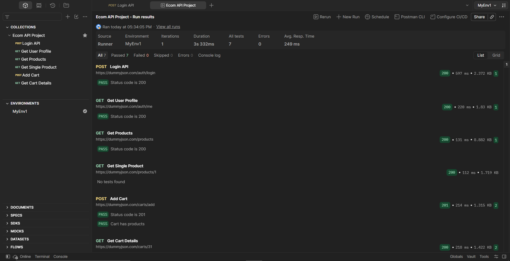

# 🛒 E-Commerce API Testing — Postman

> A practical API testing project built with **Postman** to validate an e-commerce workflow covering authentication, user profile, product retrieval, and cart operations.

[](https://www.postman.com/)
[](https://www.json.org/json-en.html)
[](#test-execution)
[](#test-execution)

---

## 📌 Project Overview

This project demonstrates hands-on **API testing using Postman** for an e-commerce application workflow.

The collection covers:

- 🔐 Login and token-based authentication
- 👤 User profile retrieval
- 🛍️ Product retrieval
- 🛒 Add-to-cart functionality
- 📦 Cart detail validation
- 🔗 Request chaining using environment variables
- ✅ Automated response assertions
- ▶️ Collection Runner execution

The project focuses on validating API behavior through **requests, responses, authentication, dynamic variables, and test scripts**.

---

## 🎯 Objectives

The main objectives of this project were to:

1. Validate API responses using Postman.
2. Verify HTTP status codes for key API operations.
3. Implement token-based authentication.
4. Reuse dynamic data between requests.
5. Validate basic business behavior for cart operations.
6. Execute the API collection using Postman Collection Runner.

---

## 🧰 Tools & Technologies

| Tool / Technology | Usage |
|---|---|
| **Postman** | API requests, assertions, scripting, Collection Runner |
| **JSON** | Request and response data |
| **JavaScript** | Postman test scripts |
| **Environment Variables** | Reusing token, product ID and cart ID |
| **HTTP Methods** | GET and POST API requests |

---

## 🔄 API Workflow

```text
Login API
   ↓
Extract Access Token
   ↓
Get User Profile
   ↓
Get Products
   ↓
Extract Product ID
   ↓
Get Single Product
   ↓
Add Product to Cart
   ↓
Extract Cart ID
   ↓
Get Cart Details
```

### 🔐 Authentication Flow

The Login API returns an access token which is stored in the Postman environment and reused for authenticated requests.

```text
Login
  ↓
accessToken
  ↓
{{token}}
  ↓
Bearer Authentication
  ↓
Get User Profile
```

### 🔗 Request Chaining

Dynamic values are extracted from API responses and reused in subsequent requests.

Examples:

- `token` → used for Bearer authentication
- `product_id` → used for product and cart requests
- `cart_id` → stored for cart workflow usage

---

## 🧪 API Test Coverage

| # | API | Method | Validation |
|---:|---|:---:|---|
| 1 | Login API | `POST` | HTTP `200` |
| 2 | Get User Profile | `GET` | HTTP `200` |
| 3 | Get Products | `GET` | HTTP `200` |
| 4 | Get Single Product | `GET` | Request executed successfully; no automated assertion configured |
| 5 | Add Cart | `POST` | HTTP `201` |
| 6 | Add Cart | `POST` | Cart contains products |
| 7 | Get Cart Details | `GET` | HTTP `200` |
| 8 | Get Cart Details | `GET` | Cart total is greater than `0` |

> **Note:** The Postman Collection Runner executed **7 automated tests**. The `Get Single Product` request returned HTTP `200`, but Postman showed **"No tests found"**, so it is not counted as an automated test result.

---

## ✅ Test Execution

The collection was executed using **Postman Collection Runner**.

| Metric | Result |
|---|---:|
| Iterations | **1** |
| Automated Tests | **7** |
| Passed | **7** |
| Failed | **0** |
| Skipped | **0** |
| Errors | **0** |
| Pass Rate | **100%** |
| Average Response Time | **249 ms** |
| Total Duration | **3.332 s** |

### 📸 Postman Run Result



---

## 📂 Repository Structure

```text
ecommerce-api-testing-postman/
│
├── 📄 README.md
│
├── 📁 Postman/
│   ├── ECommerce_API_Collection.json
│   └── ECommerce_API_Environment.json
│
├── 📁 Test-Cases/
│   └── API_Test_Cases.xlsx
│
├── 📁 Test-Execution/
│   └── Test_Execution_Report.xlsx
│
└── 📁 Screenshots/
    └── Postman_Run_Result.png
```

---

## 📋 Test Documentation

### Test Cases

The `API_Test_Cases.xlsx` file documents the API scenarios and expected results covered by the Postman collection.

### Test Execution Report

The `Test_Execution_Report.xlsx` file records the actual Collection Runner execution summary, including the number of passed and failed automated tests.

---

## 🔍 Key Postman Features Demonstrated

### Environment Variables

The project uses environment variables including:

```text
base_url
token
product_id
cart_id
```

### Test Scripts

Postman test scripts are used to validate responses and save dynamic values.

Example:

```javascript
pm.test("Status code is 200", function () {
    pm.response.to.have.status(200);
});
```

### Dynamic Value Extraction

Example:

```javascript
let jsonData = pm.response.json();
pm.environment.set("product_id", jsonData.products[0].id);
```

### Response Validation

The project validates:

- HTTP status codes
- Presence of products in the cart
- Cart total value
- Authentication flow
- Reuse of dynamic response data

---

## 📦 Project Files

| Folder / File | Description |
|---|---|
| `Postman/ECommerce_API_Collection.json` | Exported Postman collection |
| `Postman/ECommerce_API_Environment.json` | Postman environment variables |
| `Test-Cases/API_Test_Cases.xlsx` | Documented API test scenarios |
| `Test-Execution/Test_Execution_Report.xlsx` | Collection Runner execution report |
| `Screenshots/Postman_Run_Result.png` | Postman execution evidence |

---

## ⚠️ Notes

- This repository contains **test artifacts for learning and portfolio demonstration**.
- No database validation is included in this project.
- Sensitive credentials, tokens, or secrets should not be committed to the repository.
- `Get Single Product` is included in request coverage, but it has no automated Postman assertion in the current collection.

---

## 👨‍💻 Author

**Adithya Salian**

[](https://github.com/AdithyaSalian23)
[](https://www.linkedin.com/in/adithyasalian/)

---

## ⭐ Project Focus

**API Testing • Postman • Authentication • Authorization • Request Chaining • Test Scripts • Response Validation • E-Commerce Workflow**
